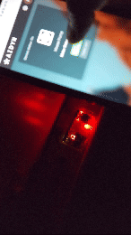

# IoT Home Automation Project
## Overview
This IoT project enables control of home appliances using a web interface. It is built using a Spring Boot backend, a ReactJS frontend, and an Arduino to control the physical switches. The system allows users to monitor and control appliances from a user-friendly web application.

## Preview

## Technologies
- Backend: Spring Boot (Java)
- Frontend: ReactJS (JavaScript)
- Hardware: Arduino (Microcontroller)
- Communication: REST API
- Database: MySQL
  
## Features
- Web-based Control Panel: Turn devices on or off through a web interface.
- Real-Time Monitoring: Monitor the status of devices (on/off).
- REST API: Exposes REST endpoints for communication between the frontend and backend.
- Arduino Control: Arduino controls the physical switches based on API requests.
- Security: Authentication and authorization using JWT.
- Voice Assistant: Can be operated using Google Assistant/Bixby

## Prerequisites
- Java 11 (or later)
- Node.js (v14 or later)
- MySQL
- Arduino IDE for microcontroller programming
- Python (to connect to voice assistant server).

## Future Enhancements
- Replace Rest connection between Arduino and Backend with Socket connection

## Contributors
[Amit Sharma](https://github.com/amits781) - Full Stack Developer

test
